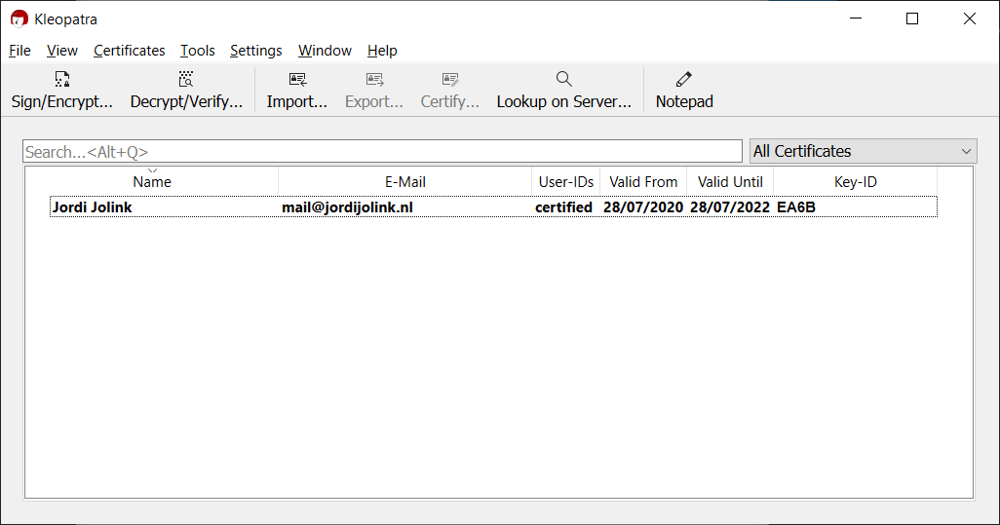
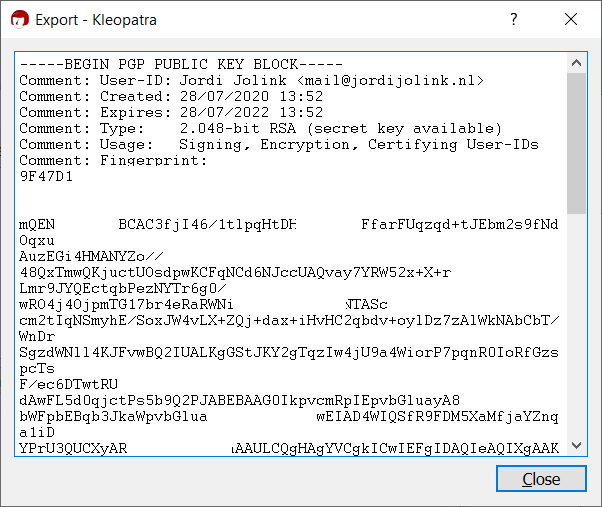
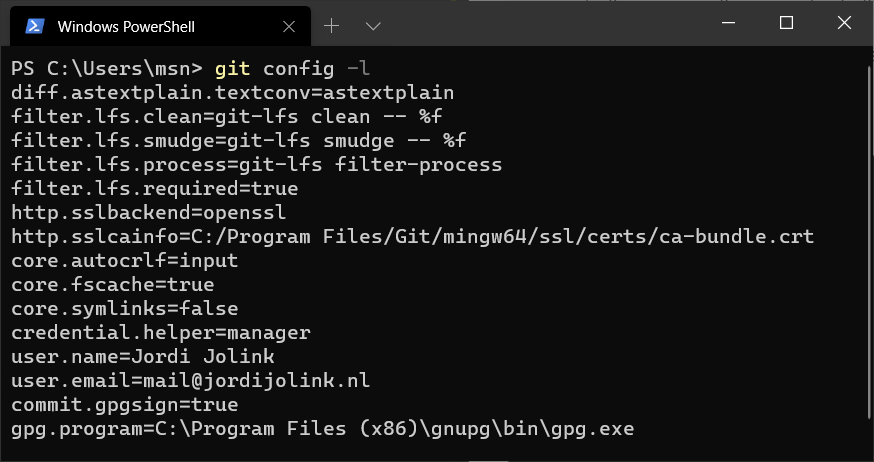

# Signing commits with GPG
---

This document is a simple step by step guideline on how to create a GPG key and use this to sign Git commits with.

Tested with:
| OS      | Tool               | Platform |
|---------|--------------------|----------|
| Windows | CLI                | Github   |
| Windows | Visual Studio      | Github   |
| Windows | Visual Studio Code | Github   |

---

## Generating keys
### Windows
#### Step 1: Download GnuPG
First of all, download and install [GnuGP](https://gnupg.org/download/).
A Windows installer is available.

#### Step 2: Generate key
Open a command shell and execute the following command:
```
gpg --gen-key
```

#### Step 3: Check & copy key
GnuPG comes with Kleopatra.
Either open Kleopatra, or open the file `C:\Users\{user}\AppData\Roaming\gnupg\trustdb.gpg` (with Kleopatra).

The key should be available:


Now double click the key and choose export.
Copy all the text in the window and use this to add this public key to a (git) platform like Github.
See the chapter `Adding keys to a platform` in this Readme file.


#### Step 4: Set signing with GPG key for commits in Git global settings
Now open the (global) .gitconfig file, usually `C:\Users\{user}\.gitconfig`.

Add `gpgsign = true` under `[commit]`.
Add `program = {gpg.exe-full-location}` under `[commit]`.

An example of this file:

```
[user]
	name = Jordi Jolink
	email = mail@jordijolink.nl
[commit]
	gpgsign = true
[gpg]
	program = C:\\Program Files (x86)\\gnupg\\bin\\gpg.exe
```

Validate the settings by opening a command shell and executing the following command: `git config -l`.
This will list all of the settings, and should include the `gpgsign` setting.

Example output:


### MacOS
_Will be added in the future._

---

## Adding keys to a platform
### Github
For this, the contents of the public key must be copied to the clipboard.
Go to Github, click you profile icon, go to settings and open `SSH and GPG keys`.
On the bottom of the page click the button `New GPG key`.
Paste the GPG key and add it.

### Azure DevOps
_Will be added in the future._
